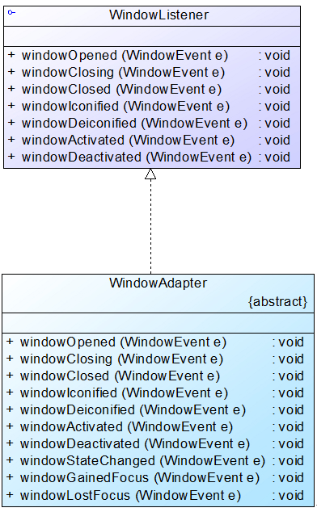

# 不兼容结构的协调——适配器模式（四）  

## 缺省适配器   

缺省适配器模式是适配器模式的一种变体，其应用也较为广泛。缺省适配器模式的定义如下：
缺省适配器模式(Default Adapter Pattern)：当不需要实现一个接口所提供的所有方法时，可先设计一个抽象类实现该接口，并为接口中每个方法提供一个默认实现（空方法），那么该抽象类的子类可以选择性地覆盖父类的某些方法来实现需求，它适用于不想使用一个接口中的所有方法的情况，又称为单接口适配器模式。  

缺省适配器模式结构如图所示：
 
   

在缺省适配器模式中，包含如下三个角色：  

- **ServiceInterface（适配者接口）**：它是一个接口，通常在该接口中声明了大量的方法。  

- **AbstractServiceClass（缺省适配器类）**：它是缺省适配器模式的核心类，使用空方法的形式实现了在 ServiceInterface 接口中声明的方法。通常将它定义为抽象类，因为对它进行实例化没有任何意义。  

- **ConcreteServiceClass（具体业务类）**：它是缺省适配器类的子类，在没有引入适配器之前，它需要实现适配者接口，因此需要实现在适配者接口中定义的所有方法，而对于一些无须使用的方法也不得不提供空实现。在有了缺省适配器之后，可以直接继承该适配器类，根据需要有选择性地覆盖在适配器类中定义的方法。  

在 JDK 类库的事件处理包 java.awt.event 中广泛使用了缺省适配器模式，如 WindowAdapter、KeyAdapter、MouseAdapter 等。下面我们以处理窗口事件为例来进行说明：在 Java 语言中，一般我们可以使用两种方式来实现窗口事件处理类，一种是通过实现 WindowListener 接口，另一种是通过继承 WindowAdapter 适配器类。如果是使用第一种方式，直接实现 WindowListener 接口，事件处理类需要实现在该接口中定义的七个方法，而对于大部分需求可能只需要实现一两个方法，其他方法都无须实现，但由于语言特性我们不得不为其他方法也提供一个简单的实现（通常是空实现），这给使用带来了麻烦。而使用缺省适配器模式就可以很好地解决这一问题，在 JDK 中提供了一个适配器类 WindowAdapter 来实现 WindowListener 接口，该适配器类为接口中的每一个方法都提供了一个空实现，此时事件处理类可以继承 WindowAdapter 类，而无须再为接口中的每个方法都提供实现。如图 9-8 所示：  
 
   

## 适配器模式总结  

适配器模式将现有接口转化为客户类所期望的接口，实现了对现有类的复用，它是一种使用频率非常高的设计模式，在软件开发中得以广泛应用，在 Spring 等开源框架、驱动程序设计（如 JDBC 中的数据库驱动程序）中也使用了适配器模式。  

### 主要优点 

无论是对象适配器模式还是类适配器模式都具有如下优点：  

(1) 将目标类和适配者类解耦，通过引入一个适配器类来重用现有的适配者类，无须修改原有结构。  

(2) 增加了类的透明性和复用性，将具体的业务实现过程封装在适配者类中，对于客户端类而言是透明的，而且提高了适配者的复用性，同一个适配者类可以在多个不同的系统中复用。  

(3) 灵活性和扩展性都非常好，通过使用配置文件，可以很方便地更换适配器，也可以在不修改原有代码的基础上增加新的适配器类，完全符合“开闭原则”。  

具体来说，类适配器模式还有如下优点：  

由于适配器类是适配者类的子类，因此可以在适配器类中置换一些适配者的方法，使得适配器的灵活性更强。  

对象适配器模式还有如下优点：  

(1) 一个对象适配器可以把多个不同的适配者适配到同一个目标；  

(2) 可以适配一个适配者的子类，由于适配器和适配者之间是关联关系，根据“里氏代换原则”，适配者的子类也可通过该适配器进行适配。  

### 主要缺点

类适配器模式的缺点如下：  

(1) 对于 Java、C# 等不支持多重类继承的语言，一次最多只能适配一个适配者类，不能同时适配多个适配者；  

(2) 适配者类不能为最终类，如在 Java 中不能为 final 类，C# 中不能为 sealed 类；  

(3) 在 Java、C# 等语言中，类适配器模式中的目标抽象类只能为接口，不能为类，其使用有一定的局限性。  

对象适配器模式的缺点如下：  

与类适配器模式相比，要在适配器中置换适配者类的某些方法比较麻烦。如果一定要置换掉适配者类的一个或多个方法，可以先做一个适配者类的子类，将适配者类的方法置换掉，然后再把适配者类的子类当做真正的适配者进行适配，实现过程较为复杂。  

### 适用场景

在以下情况下可以考虑使用适配器模式：  

(1) 系统需要使用一些现有的类，而这些类的接口（如方法名）不符合系统的需要，甚至没有这些类的源代码。  

(2) 想创建一个可以重复使用的类，用于与一些彼此之间没有太大关联的一些类，包括一些可能在将来引进的类一起工作。  

## 练习 

Sunny 软件公司 OA 系统需要提供一个加密模块，将用户机密信息（如口令、邮箱等）加密之后再存储在数据库中，系统已经定义好了数据库操作类。为了提高开发效率，现需要重用已有的加密算法，这些算法封装在一些由第三方提供的类中，有些甚至没有源代码。试使用适配器模式设计该加密模块，实现在不修改现有类的基础上重用第三方加密方法。
