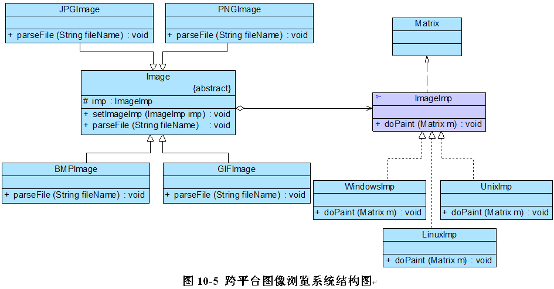

# 处理多维度变化——桥接模式（三）  

## 完整解决方案  

为了减少所需生成的子类数目，实现将操作系统和图像文件格式两个维度分离，使它们可以独立改变，Sunny 公司开发人员使用桥接模式来重构跨平台图像浏览系统的设计，其基本结构如图所示：  

 

在图中，Image 充当抽象类，其子类 JPGImage、PNGImage、BMPImage 和 GIFImage 充当扩充抽象类；ImageImp 充当实现类接口，其子类 WindowsImp、LinuxImp 和 UnixImp 充当具体实现类。完整代码如下所示：

```
//像素矩阵类：辅助类，各种格式的文件最终都被转化为像素矩阵，不同的操作系统提供不同的方式显示像素矩阵
class Matrix {
	//此处代码省略
}

//抽象图像类：抽象类
abstract class Image {
	protected ImageImp imp;

	public void setImageImp(ImageImp imp) {
		this.imp = imp;
	} 

	public abstract void parseFile(String fileName);
}

//抽象操作系统实现类：实现类接口
interface ImageImp {
	public void doPaint(Matrix m);  //显示像素矩阵m
} 

//Windows操作系统实现类：具体实现类
class WindowsImp implements ImageImp {
    public void doPaint(Matrix m) {
    	//调用Windows系统的绘制函数绘制像素矩阵
    	System.out.print("在Windows操作系统中显示图像：");
    }
}

//Linux操作系统实现类：具体实现类
class LinuxImp implements ImageImp {
    public void doPaint(Matrix m) {
    	//调用Linux系统的绘制函数绘制像素矩阵
    	System.out.print("在Linux操作系统中显示图像：");
    }
}

//Unix操作系统实现类：具体实现类
class UnixImp implements ImageImp {
    public void doPaint(Matrix m) {
    	//调用Unix系统的绘制函数绘制像素矩阵
    	System.out.print("在Unix操作系统中显示图像：");
    }
}

//JPG格式图像：扩充抽象类
class JPGImage extends Image {
	public void parseFile(String fileName) {
        //模拟解析JPG文件并获得一个像素矩阵对象m;
        Matrix m = new Matrix(); 
        imp.doPaint(m);
        System.out.println(fileName + "，格式为JPG。");
    }
}

//PNG格式图像：扩充抽象类
class PNGImage extends Image {
	public void parseFile(String fileName) {
        //模拟解析PNG文件并获得一个像素矩阵对象m;
        Matrix m = new Matrix(); 
        imp.doPaint(m);
        System.out.println(fileName + "，格式为PNG。");
    }
}

//BMP格式图像：扩充抽象类
class BMPImage extends Image {
	public void parseFile(String fileName) {
        //模拟解析BMP文件并获得一个像素矩阵对象m;
        Matrix m = new Matrix(); 
        imp.doPaint(m);
        System.out.println(fileName + "，格式为BMP。");
    }
}

//GIF格式图像：扩充抽象类
class GIFImage extends Image {
	public void parseFile(String fileName) {
        //模拟解析GIF文件并获得一个像素矩阵对象m;
        Matrix m = new Matrix(); 
        imp.doPaint(m);
        System.out.println(fileName + "，格式为GIF。");
    }
}
```

为了让系统具有更好的灵活性和可扩展性，我们引入了配置文件，将具体扩充抽象类和具体实现类类名都存储在配置文件中，再通过反射生成对象，将生成的具体实现类对象注入到扩充抽象类对象中，其中，配置文件 config.xml 的代码如下所示：  

```
<?xml version="1.0"?>  
<config>  
    <!--RefinedAbstraction-->  
    <className>JPGImage</className>   
    <!--ConcreteImplementor-->  
    <className>WindowsImp</className>  
</config>  
```

用于读取配置文件 config.xml 并反射生成对象的 XMLUtil 类的代码如下所示：  

```
import javax.xml.parsers.*;
import org.w3c.dom.*;
import org.xml.sax.SAXException;
import java.io.*;
public class XMLUtil {
//该方法用于从XML配置文件中提取具体类类名，并返回一个实例对象
	public static Object getBean(String args) {
		try {
			//创建文档对象
			DocumentBuilderFactory dFactory = DocumentBuilderFactory.newInstance();
			DocumentBuilder builder = dFactory.newDocumentBuilder();
			Document doc;							
			doc = builder.parse(new File("config.xml")); 
			NodeList nl=null;
			Node classNode=null;
			String cName=null;
			nl = doc.getElementsByTagName("className");
			
			if(args.equals("image")) {
				//获取第一个包含类名的节点，即扩充抽象类
	            classNode=nl.item(0).getFirstChild();
	            
			}
			else if(args.equals("os")) {
			   //获取第二个包含类名的节点，即具体实现类
	            classNode=nl.item(1).getFirstChild();
			}
			
	         cName=classNode.getNodeValue();
	         //通过类名生成实例对象并将其返回
	         Class c=Class.forName(cName);
		  	 Object obj=c.newInstance();
	         return obj;		
           }   
           catch(Exception e) {
              e.printStackTrace();
              return null;
          }
     }
}
```

编写如下客户端测试代码：  

```
class Client {
	public static void main(String args[]) {
		Image image;
		ImageImp imp;
		image = (Image)XMLUtil.getBean("image");
		imp = (ImageImp)XMLUtil.getBean("os");
		image.setImageImp(imp);
		image.parseFile("小龙女");
	}
}
```

编译并运行程序，输出结果如下：  

```
在 Windows 操作系统中显示图像：小龙女，格式为 JPG。
```

如果需要更换图像文件格式或者更换操作系统，只需修改配置文件即可，在实际使用时，**可以通过分析图像文件格式后缀名来确定具体的文件格式，在程序运行时获取操作系统信息来确定操作系统类型**，无须使用配置文件。当增加新的图像文件格式或者操作系统时，原有系统无须做任何修改，只需增加一个对应的扩充抽象类或具体实现类即可，系统具有较好的可扩展性，完全符合“开闭原则”。