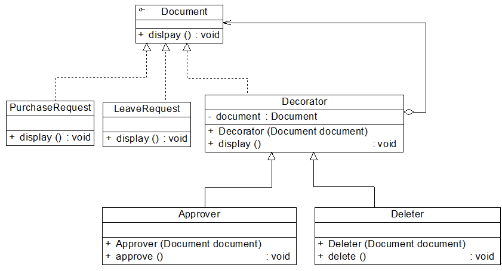

# 扩展系统功能——装饰模式（四）

## 透明装饰模式与半透明装饰模式  

装饰模式虽好，但存在一个问题。如果客户端希望单独调用具体装饰类新增的方法，而不想通过抽象构件中声明的方法来调用新增方法时将遇到一些麻烦，我们通过一个实例来对这种情况加以说明：  

在 Sunny 软件公司开发的 Sunny OA 系统中，采购单（PurchaseRequest）和请假条（LeaveRequest）等文件（Document）对象都具有显示功能，现在要为其增加审批、删除等功能，使用装饰模式进行设计。  

我们使用装饰模式可以得到如图所示结构图：  

 

在图中，Document充当抽象构件类，PurchaseRequest 和 LeaveRequest 充当具体构件类，Decorator 充当抽象装饰类，Approver 和 Deleter 充当具体装饰类。其中 Decorator 类和 Approver 类的示例代码如下所示：  

```
//抽象装饰类
class Decorator implements  Document
{
      private Document  document;
      
      public Decorator(Document  document)
      {
             this.  document = document;
      }
      
      public void display()
      {
             document.display();
      }
}
 
//具体装饰类
class Approver extends  Decorator
{
      public Approver(Document document)
      {
             super(document);
             System.out.println("增加审批功能！");
      }
      
      public void approve()
      {
             System.out.println("审批文件！");
      }
}
```

大家注意，Approver 类继承了抽象装饰类 Decorator 的 display() 方法，同时新增了业务方法 approve()，但这两个方法是独立的，没有任何调用关系。如果客户端需要分别调用这两个方法，代码片段如下所示：  

```
Document  doc; //使用抽象构件类型定义
doc = new PurchaseRequest();
Approver newDoc; //使用具体装饰类型定义
newDoc = new Approver(doc);
newDoc.display();//调用原有业务方法
newDoc.approve();//调用新增业务方法
```

如果newDoc也使用Document类型来定义，将导致客户端无法调用新增业务方法approve()，因为在抽象构件类Document中没有对approve()方法的声明。也就是说，在客户端无法统一对待装饰之前的具体构件对象和装饰之后的构件对象。  

在实际使用过程中，由于新增行为可能需要单独调用，因此这种形式的装饰模式也经常出现，这种装饰模式被称为半透明(Semi-transparent)装饰模式，而标准的装饰模式是透明(Transparent)装饰模式。下面我们对这两种装饰模式进行较为详细的介绍：  

### 透明装饰模式

在透明装饰模式中，要求客户端完全针对抽象编程，装饰模式的透明性要求客户端程序不应该将对象声明为具体构件类型或具体装饰类型，而应该全部声明为抽象构件类型。对于客户端而言，具体构件对象和具体装饰对象没有任何区别。也就是应该使用如下代码：  

```
Component  c, c1; //使用抽象构件类型定义对象
c = new ConcreteComponent()；
c1 = new ConcreteDecorator (c)；
```
      而不应该使用如下代码：  
```
ConcreteComponent c; //使用具体构件类型定义对象
c = new ConcreteComponent()；
```
      或
```
ConcreteDecorator c1; //使用具体装饰类型定义对象
c1 = new ConcreteDecorator(c)；
```

在12.3节图形界面构件库的设计方案中使用的就是透明装饰模式，在客户端中存在如下代码片段：

```
……
Component component,componentSB,componentBB; //全部使用抽象构件定义
component = new Window();
componentSB = new ScrollBarDecorator(component);
componentBB = new BlackBorderDecorator(componentSB);
componentBB.display();
……
```

使用抽象构件类型 Component 定义全部具体构件对象和具体装饰对象，客户端可以一致地使用这些对象，因此符合透明装饰模式的要求。  

透明装饰模式可以让客户端透明地使用装饰之前的对象和装饰之后的对象，无须关心它们的区别，此外，还可以对一个已装饰过的对象进行多次装饰，得到更为复杂、功能更为强大的对象。在实现透明装饰模式时，要求具体装饰类的 operation() 方法覆盖抽象装饰类的 operation() 方法，除了调用原有对象的 operation() 外还需要调用新增的 addedBehavior() 方法来增加新行为，  

### 半透明装饰模式

透明装饰模式的设计难度较大，而且有时我们需要单独调用新增的业务方法。为了能够调用到新增方法，我们不得不用具体装饰类型来定义装饰之后的对象，而具体构件类型还是可以使用抽象构件类型来定义，这种装饰模式即为半透明装饰模式，也就是说，对于客户端而言，具体构件类型无须关心，是透明的；但是具体装饰类型必须指定，这是不透明的。如本节前面所提到的文件对象功能增加实例，为了能够调用到在 Approver 中新增方法 approve()，客户端代码片段如下所示：  

```
……
Document  doc; //使用抽象构件类型定义
doc = new PurchaseRequest();
Approver newDoc; //使用具体装饰类型定义
newDoc = new Approver(doc);
……
```

半透明装饰模式可以给系统带来更多的灵活性，设计相对简单，使用起来也非常方便；但是其最大的缺点在于不能实现对同一个对象的多次装饰，而且客户端需要有区别地对待装饰之前的对象和装饰之后的对象。在实现半透明的装饰模式时，我们只需在具体装饰类中增加一个独立的 addedBehavior() 方法来封装相应的业务处理，由于客户端使用具体装饰类型来定义装饰后的对象，因此可以单独调用 addedBehavior() 方法来扩展系统功能。  

## 思考
  
为什么半透明装饰模式不能实现对同一个对象的多次装饰？  

## 装饰模式注意事项  

在使用装饰模式时，通常我们需要注意以下几个问题：  

(1) 尽量保持装饰类的接口与被装饰类的接口相同，这样，对于客户端而言，无论是装饰之前的对象还是装饰之后的对象都可以一致对待。这也就是说，在可能的情况下，我们应该尽量使用透明装饰模式。  

(2) 尽量保持具体构件类 ConcreteComponent 是一个“轻”类，也就是说不要把太多的行为放在具体构件类中，我们可以通过装饰类对其进行扩展。  

(3) 如果只有一个具体构件类，那么抽象装饰类可以作为该具体构件类的直接子类。如图所示：

   

## 装饰模式总结  

装饰模式降低了系统的耦合度，可以动态增加或删除对象的职责，并使得需要装饰的具体构件类和具体装饰类可以独立变化，以便增加新的具体构件类和具体装饰类。在软件开发中，装饰模式应用较为广泛，例如在 JavaIO 中的输入流和输出流的设计、javax.swing 包中一些图形界面构件功能的增强等地方都运用了装饰模式。  

### 主要优点 

装饰模式的主要优点如下：  

(1) 对于扩展一个对象的功能，装饰模式比继承更加灵活性，不会导致类的个数急剧增加。  

(2) 可以通过一种动态的方式来扩展一个对象的功能，通过配置文件可以在运行时选择不同的具体装饰类，从而实现不同的行为。  

(3) 可以对一个对象进行多次装饰，通过使用不同的具体装饰类以及这些装饰类的排列组合，可以创造出很多不同行为的组合，得到功能更为强大的对象。  

(4) 具体构件类与具体装饰类可以独立变化，用户可以根据需要增加新的具体构件类和具体装饰类，原有类库代码无须改变，符合“开闭原则”。  

### 主要缺点  

装饰模式的主要缺点如下：  

(1) 使用装饰模式进行系统设计时将产生很多小对象，这些对象的区别在于它们之间相互连接的方式有所不同，而不是它们的类或者属性值有所不同，大量小对象的产生势必会占用更多的系统资源，在一定程序上影响程序的性能。  

(2) 装饰模式提供了一种比继承更加灵活机动的解决方案，但同时也意味着比继承更加易于出错，排错也很困难，对于多次装饰的对象，调试时寻找错误可能需要逐级排查，较为繁琐。  

### 适用场景   

在以下情况下可以考虑使用装饰模式：  

(1) 在不影响其他对象的情况下，以动态、透明的方式给单个对象添加职责。  

(2) 当不能采用继承的方式对系统进行扩展或者采用继承不利于系统扩展和维护时可以使用装饰模式。不能采用继承的情况主要有两类：第一类是系统中存在大量独立的扩展，为支持每一种扩展或者扩展之间的组合将产生大量的子类，使得子类数目呈爆炸性增长；第二类是因为类已定义为不能被继承（如 Java 语言中的 final 类）。  

## 练习 

Sunny 软件公司欲开发了一个数据加密模块，可以对字符串进行加密。最简单的加密算法通过对字母进行移位来实现，同时还提供了稍复杂的逆向输出加密，还提供了更为高级的求模加密。用户先使用最简单的加密算法对字符串进行加密，如果觉得还不够可以对加密之后的结果使用其他加密算法进行二次加密，当然也可以进行第三次加密。试使用装饰模式设计该多重加密系统。