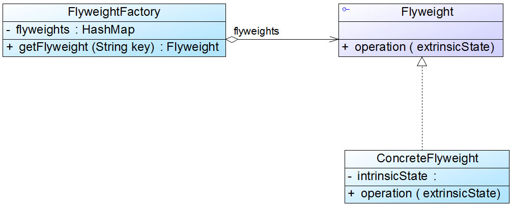
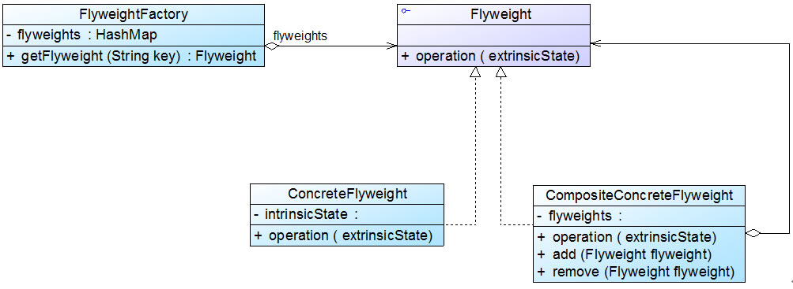

# 实现对象的复用——享元模式（五）  

## 单纯享元模式和复合享元模式  

标准的享元模式结构图中既包含可以共享的具体享元类，也包含不可以共享的非共享具体享元类。但是在实际使用过程中，我们有时候会用到两种特殊的享元模式：单纯享元模式和复合享元模式，下面将对这两种特殊的享元模式进行简单的介绍：  

**1.单纯享元模式**  

在单纯享元模式中，所有的具体享元类都是可以共享的，不存在非共享具体享元类。单纯享元模式的结构如图所示：

     

**2.复合享元模式**  

将一些单纯享元对象使用组合模式加以组合，还可以形成复合享元对象，这样的复合享元对象本身不能共享，但是它们可以分解成单纯享元对象，而后者则可以共享。复合享元模式的结构如图所示：

   

通过复合享元模式，可以确保复合享元类 CompositeConcreteFlyweight 中所包含的每个单纯享元类 ConcreteFlyweight 都具有相同的外部状态，而这些单纯享元的内部状态往往可以不同。如果希望为多个内部状态不同的享元对象设置相同的外部状态，可以考虑使用复合享元模式。  

## 关于享元模式的几点补充  

**1.与其他模式的联用**  

享元模式通常需要和其他模式一起联用，几种常见的联用方式如下：  

(1)在享元模式的享元工厂类中通常提供一个静态的工厂方法用于返回享元对象，使用简单工厂模式来生成享元对象。  

(2)在一个系统中，通常只有唯一一个享元工厂，因此可以使用单例模式进行享元工厂类的设计。  

(3)享元模式可以结合组合模式形成复合享元模式，统一对多个享元对象设置外部状态。  

2.享元模式与 String 类  

JDK 类库中的 String 类使用了享元模式，我们通过如下代码来加以说明：

```
class Demo {
       public  static void main(String args[]) {
              String  str1 = "abcd";
              String  str2 = "abcd";
              String  str3 = "ab" + "cd";
              String  str4 = "ab";
              str4  += "cd";
             
              System.out.println(str1  == str2);
              System.out.println(str1  == str3);
              System.out.println(str1  == str4);
             
              str2  += "e";
              System.out.println(str1  == str2);
       }
}
```

在 Java 语言中，如果每次执行类似 String str1="abcd"的操作时都创建一个新的字符串对象将导致内存开销很大，因此如果第一次创建了内容为"abcd"的字符串对象 str1，下一次再创建内容相同的字符串对象 str2 时会将它的引用指向"abcd"，不会重新分配内存空间，从而实现了"abcd"在内存中的共享。上述代码输出结果如下：  
true  
true  
false  
false  

可以看出，前两个输出语句均为 true，说明 str1、str2、str3 在内存中引用了相同的对象；如果有一个字符串 str4，其初值为"ab"，再对它进行操作str4 += "cd"，此时虽然 str4 的内容与str1相同，但是由于str4的初始值不同，在创建 str4 时重新分配了内存，所以第三个输出语句结果为 false；最后一个输出语句结果也为 false，说明当对 str2 进行修改时将创建一个新的对象，修改工作在新对象上完成，而原来引用的对象并没有发生任何改变，str1 仍然引用原有对象，而 str2 引用新对象，str1 与 str2 引用了两个完全不同的对象。  
 
**扩展**  
关于 Java String 类这种在修改享元对象时，先将原有对象复制一份，然后在新对象上再实施修改操作的机制称为“Copy On Write”，大家可以自行查询相关资料来进一步了解和学习“Copy On Write”机制，在此不作详细说明。  

## 享元模式总结  

当系统中存在大量相同或者相似的对象时，享元模式是一种较好的解决方案，它通过共享技术实现相同或相似的细粒度对象的复用，从而节约了内存空间，提高了系统性能。相比其他结构型设计模式，享元模式的使用频率并不算太高，但是作为一种以“节约内存，提高性能”为出发点的设计模式，它在软件开发中还是得到了一定程度的应用。  

**1.主要优点**  

享元模式的主要优点如下：  

(1) 可以极大减少内存中对象的数量，使得相同或相似对象在内存中只保存一份，从而可以节约系统资源，提高系统性能。  

(2) 享元模式的外部状态相对独立，而且不会影响其内部状态，从而使得享元对象可以在不同的环境中被共享。  

**2.主要缺点**  

享元模式的主要缺点如下：  

(1) 享元模式使得系统变得复杂，需要分离出内部状态和外部状态，这使得程序的逻辑复杂化。  

(2) 为了使对象可以共享，享元模式需要将享元对象的部分状态外部化，而读取外部状态将使得运行时间变长。  

**3.适用场景**  

在以下情况下可以考虑使用享元模式：  

(1) 一个系统有大量相同或者相似的对象，造成内存的大量耗费。  

(2) 对象的大部分状态都可以外部化，可以将这些外部状态传入对象中。  

(3) 在使用享元模式时需要维护一个存储享元对象的享元池，而这需要耗费一定的系统资源，因此，应当在需要多次重复使用享元对象时才值得使用享元模式。  

**练习**  
Sunny 软件公司欲开发一个多功能文档编辑器，在文本文档中可以插入图片、动画、视频等多媒体资料，为了节约系统资源，相同的图片、动画和视频在同一个文档中只需保存一份，但是可以多次重复出现，而且它们每次出现时位置和大小均可不同。试使用享元模式设计该文档编辑器。